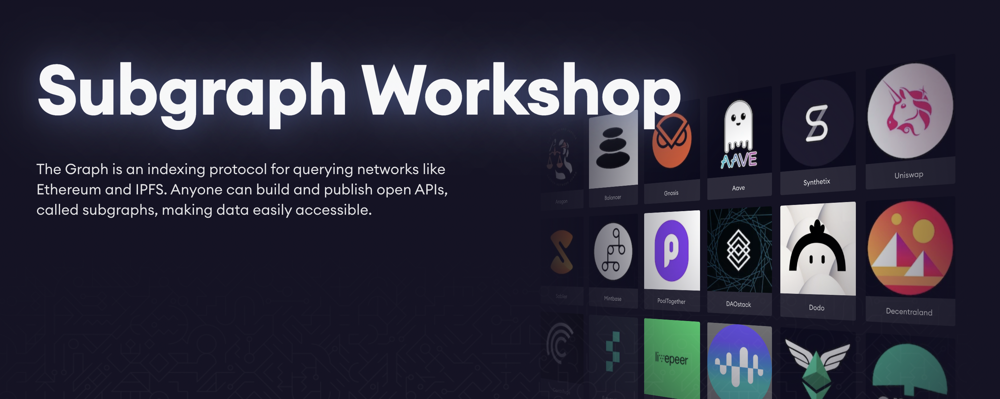
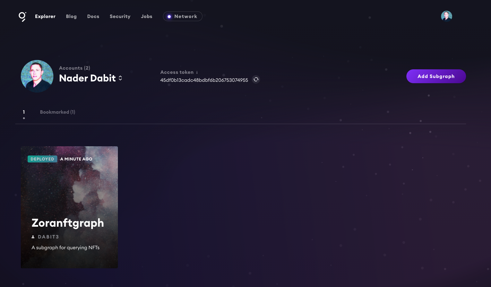
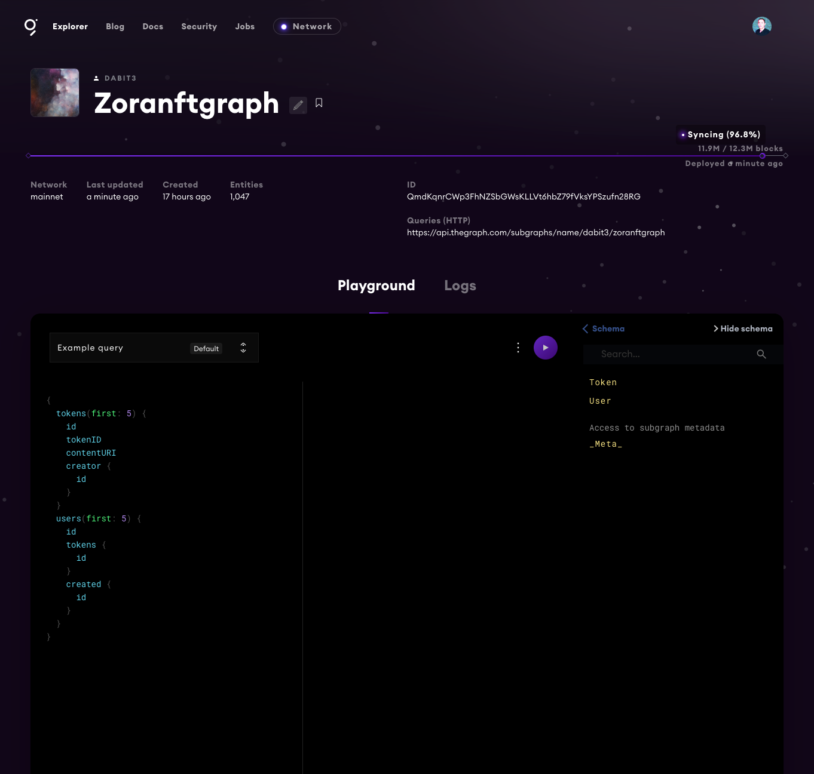

## The Graph - Subgraph Workshop



In this workshop, you'll learn how to build and deploy a subgraph using the [Zora NFT](https://zora.co/) smart contract.

### Prerequisites

To be successful in this workshop, you should have [Node.js](https://github.com/nvm-sh/nvm#node-version-manager---) installed on your machine.

## Getting started

### Creating the Graph project in the Graph console

To get started, open the [Graph Console](https://thegraph.com/explorer/dashboard) and either sign in or create a new account.

Next, go to [the dashboard](https://thegraph.com/explorer/dashboard) and click on __Add Subgraph__ to create a new subgraph.

Here, set your graph up with the following properties:

- Subgraph Name - __Zoranftgraph__
- Subtitle - __A subgraph for querying NFTs__
- Optional - Fill the description and GITHUB URL properties

Once the subgraph is created, we will initialize the subgraph locally.

### Initializing a new subgraph using the Graph CLI

Next, install the Graph CLI:

```sh
$ npm install -g @graphprotocol/graph-cli

# or

$ yarn global add @graphprotocol/graph-cli
```

Once the Graph CLI has been installed you can initialize a new subgraph with the Graph CLI `init` command.

There are two ways to initialize a new subgraph:

1. From an example subgraph

```sh
$ graph init --from-example <GITHUB_USERNAME>/<SUBGRAPH_NAME> [<DIRECTORY>]
```

2. From an existing smart contract

If you already have a smart contract deployed to Ethereum mainnet or one of the testnets, initializing a new subgraph from this contract is an easy way to get up and running.

```sh
$ graph init --from-contract <CONTRACT_ADDRESS> \
  [--network <ETHEREUM_NETWORK>] \
  [--abi <FILE>] \
  <GITHUB_USER>/<SUBGRAPH_NAME> [<DIRECTORY>]
```

In our case we'll be using the [Zora Token Contract](https://etherscan.io/address/0xabEFBc9fD2F806065b4f3C237d4b59D9A97Bcac7#code) so we can initilize from that contract address:

```sh
$ graph init --from-contract 0xabEFBc9fD2F806065b4f3C237d4b59D9A97Bcac7 --network mainnet --contract-name Token --index-events

? Subgraph name › your-username/Zoranftgraph
? Directory to create the subgraph in › Zoranftgraph
? Ethereum network › Mainnet
? Contract address › 0xabEFBc9fD2F806065b4f3C237d4b59D9A97Bcac7
? Contract Name · Token
```

This command will generate a basic subgraph based off of the contract address passed in as the argument to `--from-contract`. By using this contract address, the CLI will initialize a few things in your project to get you started (including fetching the `abis` and saving them in the __abis__ directory).

> By passing in `--index-events` the CLI will automatically populate some code for us both in __schema.graphql__ as well as __src/mapping.ts__ based on the events emitted from the contract.

The main configuration and definition for the subgraph lives in the __subgraph.yaml__ file. The subgraph codebase consists of a few files:

- __subgraph.yaml__: a YAML file containing the subgraph manifest
- __schema.graphql__: a GraphQL schema that defines what data is stored for your subgraph, and how to query it via GraphQL
- __AssemblyScript Mappings__: AssemblyScript code that translates from the event data in Ethereum to the entities defined in your schema (e.g. mapping.ts in this tutorial)

The entries in __subgraph.yaml__ that we will be working with are:

- `description` (optional): a human-readable description of what the subgraph is. This description is displayed by the Graph Explorer when the subgraph is deployed to the Hosted Service.
- `repository` (optional): the URL of the repository where the subgraph manifest can be found. This is also displayed by the Graph Explorer.
- `dataSources.source`: the address of the smart contract the subgraph sources, and the abi of the smart contract to use. The address is optional; omitting it allows to index matching events from all contracts.
- `dataSources.source.startBlock` (optional): the number of the block that the data source starts indexing from. In most cases we suggest using the block in which the contract was created.
- `dataSources.mapping.entities` : the entities that the data source writes to the store. The schema for each entity is defined in the the schema.graphql file.
- `dataSources.mapping.abis`: one or more named ABI files for the source contract as well as any other smart contracts that you interact with from within the mappings.
- `dataSources.mapping.eventHandlers`: lists the smart contract events this subgraph reacts to and the handlers in the mapping — __./src/mapping.ts__ in the example — that transform these events into entities in the store.

### Defining the entities

With The Graph, you define entity types in __schema.graphql__, and Graph Node will generate top level fields for querying single instances and collections of that entity type. Each type that should be an entity is required to be annotated with an `@entity` directive.

The entities / data we will be indexing are the `Token` and `User`. This way we can index the Tokens created by the users as well as the users themselves.

To do this, update __schema.graphql__ with the following code:

```graphql
type Token {
  id: ID!
  tokenID: BigInt!
  contentURI: String!
  metadataURI: String!
  creator: User!
  owner: User!
}

type User @entity {
  id: ID!
  tokens: [Token!]! @derivedFrom(field: "owner")
  created: [Token!]! @derivedFrom(field: "creator")
}
```

### On Relationships via `@derivedFrom` (from the docs):

Reverse lookups can be defined on an entity through the `@derivedFrom` field. This creates a virtual field on the entity that may be queried but cannot be set manually through the mappings API. Rather, it is derived from the relationship defined on the other entity. For such relationships, it rarely makes sense to store both sides of the relationship, and both indexing and query performance will be better when only one side is stored and the other is derived.

For one-to-many relationships, the relationship should always be stored on the 'one' side, and the 'many' side should always be derived. Storing the relationship this way, rather than storing an array of entities on the 'many' side, will result in dramatically better performance for both indexing and querying the subgraph. In general, storing arrays of entities should be avoided as much as is practical.

Now that we have created the GraphQL schema for our app, we can generate the entities locally to start using in the `mappings` created by the CLI:

```sh
graph codegen
```

Next, open __src/mappings.ts__ to write the mappings that we will be needing for our Graph.

Update the file with the following code:

```typescript
import {
  TokenURIUpdated as TokenURIUpdatedEvent,
  Transfer as TransferEvent,
  Token as TokenContract
} from "../generated/Token/Token"

import {
  Token, User
} from '../generated/schema'

export function handleTokenURIUpdated(event: TokenURIUpdatedEvent): void {
  let token = Token.load(event.params._tokenId.toString());
  token.contentURI = event.params._uri;
  token.save();
}

export function handleTransfer(event: TransferEvent): void {
  let token = Token.load(event.params.tokenId.toString());
  if (!token) {
    token = new Token(event.params.tokenId.toString());
    token.creator = event.params.to.toHexString();
    token.tokenID = event.params.tokenId;

    let tokenContract = TokenContract.bind(event.address);
    token.contentURI = tokenContract.tokenURI(event.params.tokenId);
    token.metadataURI = tokenContract.tokenMetadataURI(event.params.tokenId);
  }
  token.owner = event.params.to.toHexString();
  token.save();

  let user = User.load(event.params.to.toHexString());
  if (!user) {
    user = new User(event.params.to.toHexString());
    user.save();
  }
}
```

These mappings will handle events for when a new token is created, transfered, or updated. When these events fire, the mappings will save the data into the subgraph.

## Updating the subgraph with the entities and mappings

Now we can configure the __subgraph.yaml__ to use the entities and mappings that we have just created.

To do so, first update the `dataSources.mapping.entities` field with the `User` and `Token` entities:

```yaml
entities:
  - Token
  - User
```

Next, update the `dataSources.mapping.eventHandlers` to include only the two handlers we have defined:

```yaml
eventHandlers:
  - event: TokenURIUpdated(indexed uint256,address,string)
    handler: handleTokenURIUpdated
  - event: Transfer(indexed address,indexed address,indexed uint256)
    handler: handleTransfer
```

Finally, update the configuration to add the `startBlock`:

```yaml
source:
  address: "0xabEFBc9fD2F806065b4f3C237d4b59D9A97Bcac7"
  abi: Token
  startBlock: 11565020
```

### Running a build

Next, let's run a build to make sure that everything is configured properly. To do so, run the `build` command:

```sh
$ graph build
```

If the build is successful, you should see a new __build__ folder generated in your root directory.

## Deploying the subgraph

To deploy, we can run the `deploy` command using the Graph CLI. To deploy, you will first need to copy the __Access token__ for the subgraph you created in the Graph console:


Next, run the following command:

```sh
$ graph auth https://api.thegraph.com/deploy/ <ACCESS_TOKEN>

$ yarn deploy
```

Once the subgraph is deployed, you should see it show up in your dashboard:



When you click on the subgraph, it should open the Graph explorer:



## Querying for data

Now that we are in the dashboard, we should be able to start querying for data. Run the following query to get a list of tokens and their metadata:

```graphql
{
  tokens {
    id
    tokenID
    contentURI
    metadataURI
  }
}
```

We can also configure the order direction:

```graphql
{
  tokens(
    orderBy:id,
    orderDirection: desc
  ) {
    id
    tokenID
    contentURI
    metadataURI
  }
}
```

Or choose to skip forward a certain number of results to implement some basic pagination:

```graphql
{
  tokens(
    skip: 100,
    orderBy:id,
    orderDirection: desc
  ) {
    id
    tokenID
    contentURI
    metadataURI
  }
}
```

## Updating the subgraph

What if we want to make some changes to the subgraph and then redeploy? This is pretty easy, so let's learn how to do it.

Let's say that we want to add a new feature to our subgraph. In addition to our existing querying capabilities, let's say that we wanted to add the capabilities to sort by the timestamp that the NFT was created.

To do so, we need to first add a new `createdAtTimestamp` field to the `Token` entity:

```graphql
type Token @entity {
  id: ID!
  tokenID: BigInt!
  contentURI: String!
  metadataURI: String!
  creator: User!
  owner: User!
  "Add new createdAtTimesamp field"
  createdAtTimestamp: BigInt!
}
```

Next, we need to update the mapping to save this new field:

```typescript
// update the handleTransfer function to add the createdAtTimestamp to the token object
export function handleTransfer(event: TransferEvent): void {
  let token = Token.load(event.params.tokenId.toString());
  if (!token) {
    token = new Token(event.params.tokenId.toString());
    token.creator = event.params.to.toHexString();
    token.tokenID = event.params.tokenId;
    // Add the createdAtTimestamp to the token object
    token.createdAtTimestamp = event.block.timestamp;

    let tokenContract = TokenContract.bind(event.address);
    token.contentURI = tokenContract.tokenURI(event.params.tokenId);
    token.metadataURI = tokenContract.tokenMetadataURI(event.params.tokenId);
  }
  token.owner = event.params.to.toHexString();
  token.save();

  let user = User.load(event.params.to.toHexString());
  if (!user) {
    user = new User(event.params.to.toHexString());
    user.save();
  }
}
```

Now we can re-deploy the subgraph:


```sh
$ yarn deploy
```

Once the subgraph has been redeployed, we can now query by timestamp to view the most recently created NFTS:

```graphql
{
  tokens(
    orderBy:createdAtTimestamp,
    orderDirection: desc
  ) {
    id
    tokenID
    contentURI
    metadataURI
  }
}
```