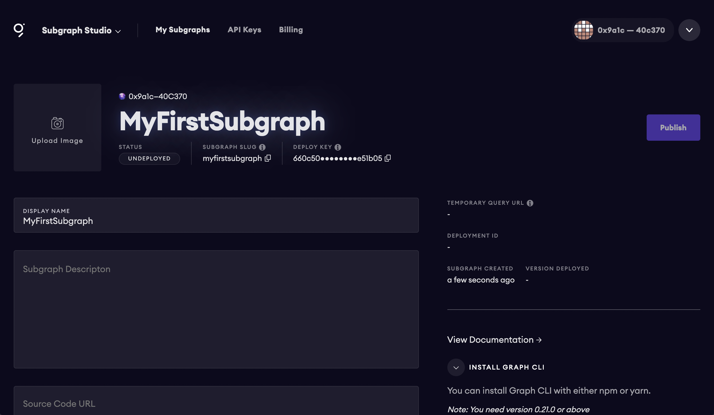
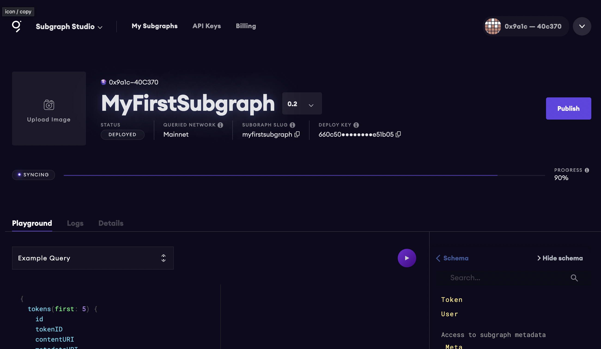

## The Graph - Subgraph Workshop

Learn how to build a GraphQL API on top of the Ethereum blockchain to query data from [Zora](https://zora.co/).


In this workshop you'll learn how to build and deploy a subgraph using the [Zora NFT](https://zora.co/) smart contract.

### Prerequisites

To be successful in this workshop, you should have [Node.js](https://github.com/nvm-sh/nvm#node-version-manager---) installed on your machine.

## Getting started

### Creating the Graph project in the Graph console

To get started, visit the Subgraph Studio at [https://thegraph.com/studio](https://thegraph.com/studio).

Here, click __Connect Wallet__ and choose a wallet address to authenticate. Once you’ve authenticated, you should be able to click __Create a Subgraph__ to create a new subgraph.


Here, give the subgraph a name and click __Continue__.

Next, you will see a view of your subgraph that enables you to add optional metadata like the subgraph description and image as well as view some useful information like the deploy key, slug, and status of the subgraph.



Now that your subgraph project has been created in the Studio, you can continue by going into your local development environment and opening your terminal.

### Initializing a new subgraph using the Graph CLI

Next, install the Graph CLI:

```sh
npm install -g @graphprotocol/graph-cli

# or

yarn global add @graphprotocol/graph-cli
```

Once the Graph CLI has been installed you can initialize a new subgraph with the Graph CLI `init` command.

In our project we'll be using the [Zora Token Contract](https://etherscan.io/address/0xabEFBc9fD2F806065b4f3C237d4b59D9A97Bcac7#code) so we can initilize from that contract address:

```sh
graph init --contract-name Token \
--index-events \
--studio \
--from-contract 0xabEFBc9fD2F806065b4f3C237d4b59D9A97Bcac7 

? Subgraph name › your-subgraph-name-from-studio
? Directory to create the subgraph in › same as above (or your preferred folder name)
? Ethereum network › Mainnet
? Contract address › 0xabEFBc9fD2F806065b4f3C237d4b59D9A97Bcac7
? Contract Name · Token
```

This command will generate a basic subgraph based off of the contract address passed in as the argument to `--from-contract`. By using this contract address, the CLI will initialize a few things in your project to get you started (including fetching the `abis` and saving them in the __abis__ directory).

> By passing in `--index-events` the CLI will automatically populate some code for us both in __schema.graphql__ as well as __src/mapping.ts__ based on the events emitted from the contract.

The main configuration and definition for the subgraph lives in the __subgraph.yaml__ file. The subgraph codebase consists of a few files:

- __subgraph.yaml__: a YAML file containing the subgraph manifest
- __schema.graphql__: a GraphQL schema that defines what data is stored for your subgraph, and how to query it via GraphQL
- __AssemblyScript Mappings__: AssemblyScript code that translates from the event data in Ethereum to the entities defined in your schema (e.g. mapping.ts in this tutorial)

The entries in __subgraph.yaml__ that we will be working with are:

- `description` (optional): a human-readable description of what the subgraph is. This description is displayed by the Graph Explorer when the subgraph is deployed to the Hosted Service.
- `repository` (optional): the URL of the repository where the subgraph manifest can be found. This is also displayed by the Graph Explorer.
- `dataSources.source`: the address of the smart contract the subgraph sources, and the abi of the smart contract to use. The address is optional; omitting it allows to index matching events from all contracts.
- `dataSources.source.startBlock` (optional): the number of the block that the data source starts indexing from. In most cases we suggest using the block in which the contract was created.
- `dataSources.mapping.entities` : the entities that the data source writes to the store. The schema for each entity is defined in the the schema.graphql file.
- `dataSources.mapping.abis`: one or more named ABI files for the source contract as well as any other smart contracts that you interact with from within the mappings.
- `dataSources.mapping.eventHandlers`: lists the smart contract events this subgraph reacts to and the handlers in the mapping — __./src/mapping.ts__ in the example — that transform these events into entities in the store.

### Defining the entities

With The Graph, you define entity types in __schema.graphql__, and Graph Node will generate top level fields for querying single instances and collections of that entity type. Each type that should be an entity is required to be annotated with an `@entity` directive.

The entities / data we will be indexing are the `Token` and `User`. This way we can index the Tokens created by the users as well as the users themselves.

To do this, update __schema.graphql__ with the following code:

```graphql
type Token @entity {
  id: ID!
  tokenID: BigInt!
  contentURI: String!
  metadataURI: String!
  createdAtTimestamp: BigInt!
  creator: User!
  owner: User!
}

type User @entity {
  id: ID!
  tokens: [Token!]! @derivedFrom(field: "owner")
  created: [Token!]! @derivedFrom(field: "creator")
}
```

### On Relationships via `@derivedFrom` (from the docs):

Reverse lookups can be defined on an entity through the `@derivedFrom` field. This creates a virtual field on the entity that may be queried but cannot be set manually through the mappings API. Rather, it is derived from the relationship defined on the other entity. For such relationships, it rarely makes sense to store both sides of the relationship, and both indexing and query performance will be better when only one side is stored and the other is derived.

For one-to-many relationships, the relationship should always be stored on the 'one' side, and the 'many' side should always be derived. Storing the relationship this way, rather than storing an array of entities on the 'many' side, will result in dramatically better performance for both indexing and querying the subgraph. In general, storing arrays of entities should be avoided as much as is practical.

Now that we have created the GraphQL schema for our app, we can generate the entities locally to start using in the `mappings` created by the CLI:

```sh
graph codegen
```

In order to make working smart contracts, events and entities easy and type-safe, the Graph CLI generates [AssemblyScript](https://www.assemblyscript.org/) types from a combination of the subgraph's GraphQL schema and the contract ABIs included in the data sources.

## Updating the subgraph with the entities and mappings

Now we can configure the __subgraph.yaml__ to use the entities that we have just created and configure their mappings.

To do so, first update the `dataSources.mapping.entities` field. Remove the existing entities, and replace them with only the `User` and `Token` entities:

```yaml
entities:
  - Token
  - User
```

Next, update the `dataSources.mapping.eventHandlers` to include only the following two event handlers:

```yaml
eventHandlers:
  - event: TokenMetadataURIUpdated(indexed uint256,address,string)
    handler: handleTokenMetadataURIUpdated
  - event: TokenURIUpdated(indexed uint256,address,string)
    handler: handleTokenURIUpdated
  - event: Transfer(indexed address,indexed address,indexed uint256)
    handler: handleTransfer
```

Finally, update the configuration to add the `startBlock`. If you do not define a `startBlock`, the subgraph will begin indexing events from the [genesis block](https://www.investopedia.com/terms/g/genesis-block.asp).

```yaml
source:
  address: "0xabEFBc9fD2F806065b4f3C237d4b59D9A97Bcac7"
  abi: Token
  startBlock: 11565020
```

The final __subgraph.yml__ should look like this:

```yml
specVersion: 0.0.2
schema:
  file: ./schema.graphql
dataSources:
  - kind: ethereum/contract
    name: Token
    network: mainnet
    source:
      address: "0xabEFBc9fD2F806065b4f3C237d4b59D9A97Bcac7"
      abi: Token
      startBlock: 11565020
    mapping:
      kind: ethereum/events
      apiVersion: 0.0.4
      language: wasm/assemblyscript
      entities:
        - Token
        - User
      abis:
        - name: Token
          file: ./abis/Token.json
      eventHandlers:
        - event: TokenMetadataURIUpdated(indexed uint256,address,string)
          handler: handleTokenMetadataURIUpdated
        - event: TokenURIUpdated(indexed uint256,address,string)
          handler: handleTokenURIUpdated
        - event: Transfer(indexed address,indexed address,indexed uint256)
          handler: handleTransfer
      file: ./src/mapping.ts
```

## Assemblyscript mappings

Next, open __src/mappings.ts__ to write the mappings that we defined in our subgraph subgraph `eventHandlers`.

Update the file with the following code:

```typescript
import {
  TokenURIUpdated as TokenURIUpdatedEvent,
  TokenMetadataURIUpdated as TokenMetadataURIUpdatedEvent,
  Transfer as TransferEvent,
  Token as TokenContract
} from "../generated/Token/Token"

import {
  Token, User
} from '../generated/schema'

export function handleTransfer(event: TransferEvent): void {
  let token = Token.load(event.params.tokenId.toString());
  if (!token) {
    token = new Token(event.params.tokenId.toString());
    token.creator = event.params.to.toHexString();
    token.tokenID = event.params.tokenId;

    let tokenContract = TokenContract.bind(event.address);
    token.contentURI = tokenContract.tokenURI(event.params.tokenId);
    token.metadataURI = tokenContract.tokenMetadataURI(event.params.tokenId);
    token.createdAtTimestamp = event.block.timestamp;
  }
  token.owner = event.params.to.toHexString();
  token.save();

  let user = User.load(event.params.to.toHexString());
  if (!user) {
    user = new User(event.params.to.toHexString());
    user.save();
  }
}

export function handleTokenURIUpdated(event: TokenURIUpdatedEvent): void {
  let token = Token.load(event.params._tokenId.toString());
  token.contentURI = event.params._uri;
  token.save();
}

export function handleTokenMetadataURIUpdated(event: TokenMetadataURIUpdatedEvent): void {
  let token = Token.load(event.params._tokenId.toString());
  token.metadataURI = event.params._uri;
  token.save();
}
```

These mappings will handle events for when a new token is created, transfered, or updated. When these events fire, the mappings will save the data into the subgraph.

### Running a build

Next, let's run a build to make sure that everything is configured properly. To do so, run the `build` command:

```sh
graph build
```

If the build is successful, you should see a new __build__ folder generated in your root directory.

## Deploying the subgraph

Now that the subgraph is completed, it’s ready to be deployed to the Studio for testing.

Before we deploy, we first need to authenticate. To do so, open Subgraph Studio dashboard for the subgraph you created and copy the `DEPLOY KEY` to your clipboard.

Next, open your CLI and run the following command:

```sh
graph auth --studio
```

When prompted, paste in your `DEPLOY KEY`.

Now you can deploy your subgraph using the deploy command:

```sh
graph deploy --studio <subgraph-name>
```

When prompted for a version label, choose a version for the subgraph.

Once the subgraph is deployed, the Studio should update with a new UI allowing you to test queries in the GraphQL playground as well as view logs and other details.



## Querying for data

Now that we are in the dashboard, we should be able to start querying for data. Run the following query to get a list of tokens and their metadata:

```graphql
{
  tokens {
    id
    tokenID
    contentURI
    metadataURI
  }
}
```

We can also configure the order direction:

```graphql
{
  tokens(
    orderBy:id,
    orderDirection: desc
  ) {
    id
    tokenID
    contentURI
    metadataURI
  }
}
```

Or choose to skip forward a certain number of results to implement some basic pagination:

```graphql
{
  tokens(
    skip: 100,
    orderBy:id,
    orderDirection: desc
  ) {
    id
    tokenID
    contentURI
    metadataURI
  }
}
```

Or query for users and their associated content:

```graphql
{
  users {
    id
    tokens {
      id
      contentURI
    }
  }
}
```

We can also query by timestamp to view the most recently created NFTS:

```graphql
{
  tokens(
    orderBy:createdAtTimestamp,
    orderDirection: desc
  ) {
    id
    tokenID
    contentURI
    metadataURI
  }
}
```

## Next steps

Next, you may want to publish your subgraph to the decentralized network.

To learn how to do this, check out the tutorial [here](https://thegraph.com/blog/building-with-subgraph-studio) and the video [here](https://www.youtube.com/watch?v=HfDgC2oNnwo).

Also check out the [Openzeppelin subgraph
](https://blog.openzeppelin.com/subgraphs-announcement/) and the repo [here](https://github.com/OpenZeppelin/openzeppelin-subgraphs).